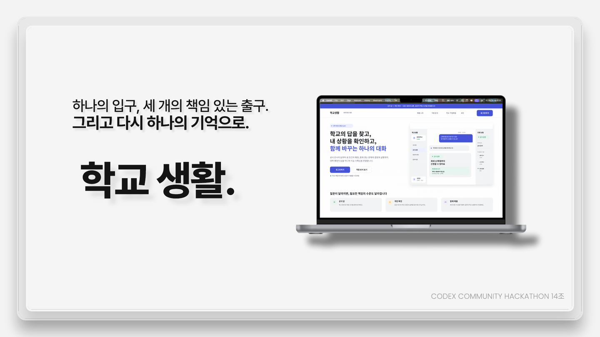
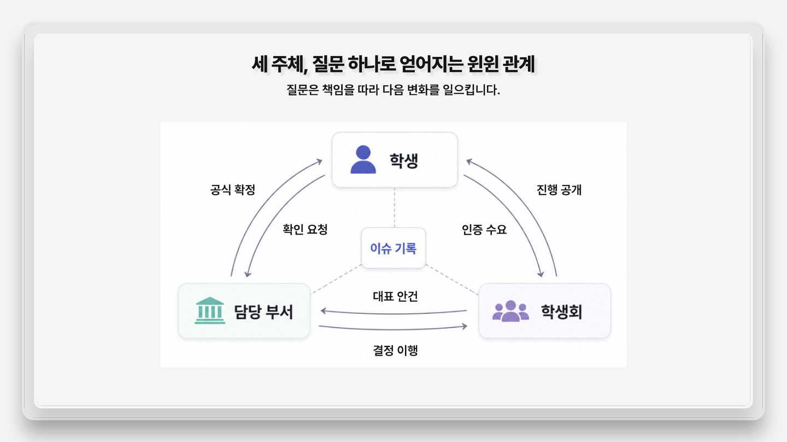

# 학교생활.

> 하나의 입구, 세 개의 책임 있는 출구. 그리고 다시 하나의 기억으로.

학생의 질문을 **공식 답변**, **권한 있는 확인**, **새로운 결정과 실행**으로 연결하고, 그 과정과 결과를 하나의 사안 기록으로 남기는 대학 생활 지원 SaaS MVP입니다.

<p align="center">
  
</p>

<p align="center">
  <a href="https://univ-agent-weld.vercel.app"><strong>배포된 데모 바로가기 →</strong></a>
</p>

## 제공 기능

학교생활의 질문은 답의 상태에 따라 세 가지 책임 흐름으로 이어집니다.

| 질문의 상태 | 연결되는 기능 | 남는 결과 |
| --- | --- | --- |
| **숨은 답** | 학교의 공식 규정과 공지에서 근거를 찾고, 적용 조건과 출처를 함께 보여줍니다. | 공식 답 |
| **끝나지 않은 답** | 일반 규정만으로 확정할 수 없는 개인 조건을 분리해 담당 부서 확인 흐름으로 연결합니다. | 개인 확인 및 처리 기록 |
| **아직 없는 답** | 같은 문제를 겪는 인증 수요를 모아 학생회 검토, 학교 결정과 실행 상태로 연결합니다. | 집단 사안 및 결정 기록 |

모든 단계는 하나의 사안 안에서 이어집니다. 학생은 누가 답했는지, 어떤 근거가 사용됐는지, 현재 어디까지 처리됐는지 확인할 수 있습니다.

<p align="center">
  
</p>

## 데모 시나리오

대학생의 수강·학점 질문 하나가 다음 흐름으로 처리됩니다.

1. 공식 규정과 수강신청 안내를 근거로 최대 신청 가능 학점을 확인합니다.
2. 공식 기준과 개인 학사시스템 표시가 다르면 담당 부서 확인 사안으로 분리합니다.
3. 필수과목 정원 부족은 인증 수요와 학생회 검토가 필요한 집단 사안으로 전환합니다.
4. 학교 결정과 학사시스템 반영을 구분해 기록하고, 신청 가능한 최종 시간표까지 연결합니다.

```text
질문 → 공식 답 → 개인 확인 → 집단 사안 → 학교 결정과 실행 → 목표 완료
```

## 기술 스택

- **Frontend:** Next.js 16, React 19, TypeScript, Tailwind CSS 4
- **Answer API:** OpenAI Responses API
- **Evidence:** 대학 공식 공지와 수강신청 자료 기반의 검증된 데모 근거
- **Fallback:** API 키가 없어도 동작하는 규칙 기반 책임 분류와 검증된 데모 답변

## 로컬 실행

```bash
npm install
cp .env.example .env.local
npm run dev
```

브라우저에서 [http://localhost:3000](http://localhost:3000)을 열어 확인합니다. OpenAI API를 사용하려면 `.env.local`에 `OPENAI_API_KEY`를 설정합니다. 키가 없으면 검증된 데모 답변으로 동작합니다.

## 문서

- [발표 자료 - 학교생활](docs/학교생활.pdf)
- [제품 명세](docs/SPEC.md)
- [UI/UX 설계](docs/DESIGN.md)
- [커밋 가이드](docs/COMMIT.md)

## 데모 범위

현재 버전은 해커톤 MVP입니다. 공식 답변에는 실제 대학 공지와 학사 자료를 근거로 사용합니다. 학교 인증, 개인 학사정보, 담당 부서 처리, 학생회 검토와 학교 결정은 외부 시스템에 직접 요청하거나 반영하지 않는 데모 흐름입니다.
